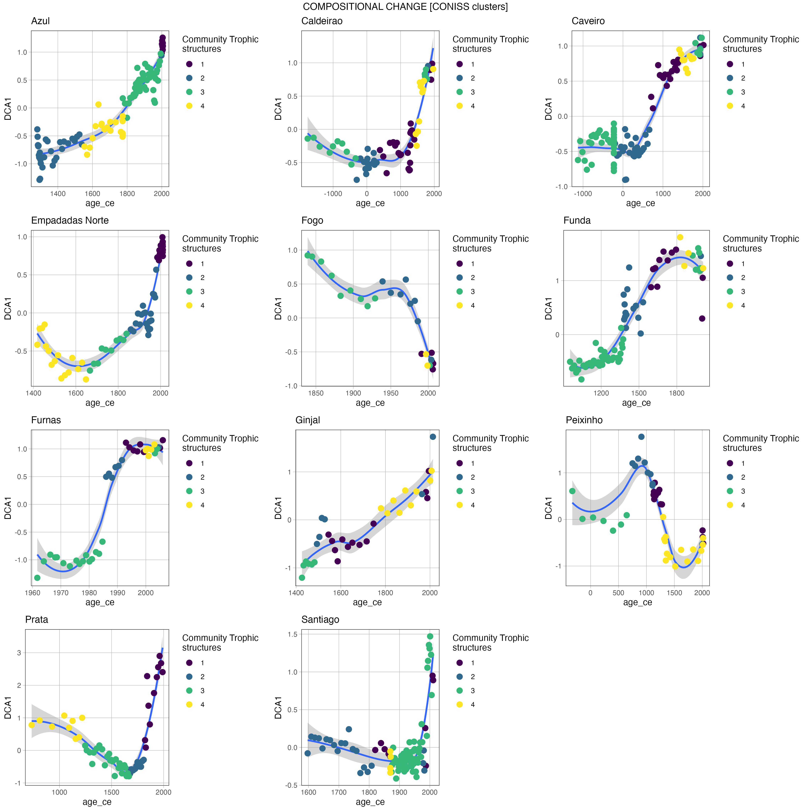

# trophic_simplification_azores
This repository contains data, analysis code, and figures for the manuscript "Humans simplified lake trophic structures over the past millennium across the Azorean archipelago"

# Long-term trophic restructuring of Azorean island lakes

This repository contains data, analysis code, and figures for the manuscript **"Humans simplified lake trophic structures over the past millennium across the Azorean archipelago"** submitted to _Nature Ecology & Evolution_.



## Contents

- `data/`: Raw and processed data files
- `code/`: R scripts for data processing, statistical modeling, and visualization
- `figures/`: Output figures used in the manuscript
- `notebooks/`: Optional RMarkdown/Quarto files for exploratory analyses
- `supplementary/`: Supplementary tables and metadata

## Requirements

All scripts are written in **R (≥4.2.0)**. Key packages used:

- `tidyverse`
- `mgcv`
- `vegan`
- `patchwork`
- `ggplot2`
- `ggraph` (if using network diagrams)
- `readr`, `here`, `janitor`

You can install dependencies using:

```R
install.packages(c("tidyverse", "mgcv", "vegan", "patchwork", "ggplot2", "ggraph", "readr", "here", "janitor"))
