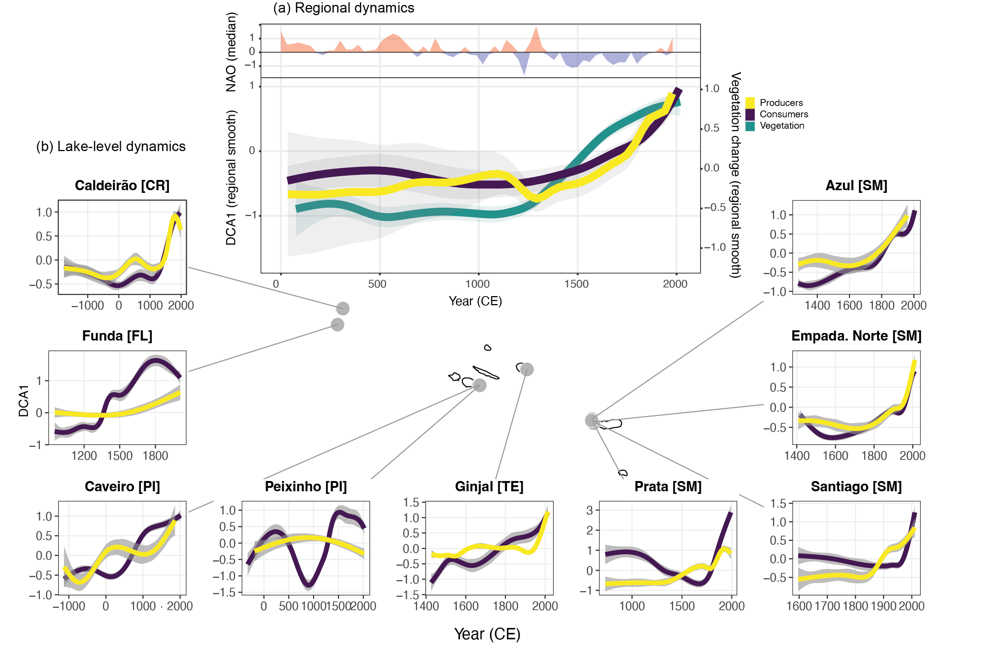

# Human-driven trophic simplification in Azorean lake ecosystems

This repository contains the analysis code and data description for the manuscript on trophic structure changes in Azorean lake ecosystems over the past two millennia. It combines paleoecological proxies (diatoms, chironomids), ordination (DCA), variance partitioning (RDA-based), and sensitivity analyses to quantify the relative roles of climate (NAO) and vegetation change.



## Project structure

```
├── data/                     # Input data (see Data section below)
├── figures/                  # Main manuscript figures
├── supplementary/            # Supplementary figures
├── outputs/                   # Intermediate outputs (if used)
├── functions/                 # Custom R functions (sourced by main script)
│   └── source_custom_functions.R
└── main_script.Rmd           # Primary analysis (run in order, chunk by chunk or Knit)
```

## Requirements

- **R** ≥ 4.2.0

All packages are loaded at the start of `main_script.Rmd`. Install any missing ones, e.g.:

```r
required_packages <- c(
  "tidyverse", "zoo", "parallel", "furrr", "scales", "png", "ggtext", "Hmisc", "scico", "conflicted",
  "ggrepel", "ggpmisc", "viridis", "cowplot", "patchwork", "gridExtra", "ggnewscale", "ggridges",
  "ggh4x", "ggspatial", "ggordiplots", "vegan", "codyn", "broom", "mgcv", "scam", "gratia",
  "caret", "e1071", "evtree", "rpart", "randomForest", "rpart.plot", "earth",
  "DALEX", "DALEXtra", "irr", "ape", "sf"
)
install.packages(required_packages[!required_packages %in% rownames(installed.packages())])
```

### Main package groups

- **Data & workflow:** `tidyverse`, `zoo`, `parallel`, `furrr`, `sf`, `scales`, `conflicted`
- **Plotting:** `ggplot2`, `ggrepel`, `ggpmisc`, `viridis`, `cowplot`, `patchwork`, `ggnewscale`, `ggridges`, `ggh4x`, `ggspatial`, `ggordiplots`, `gridExtra`, `grid`
- **Stats & ordination:** `vegan`, `codyn`, `broom`, `mgcv`, `scam`, `gratia`
- **ML & trees:** `caret`, `e1071`, `evtree`, `rpart`, `randomForest`, `rpart.plot`, `earth`, `DALEX`, `DALEXtra`, `irr`, `ape`

## Custom functions

Helper functions used in the main script (variance partitioning, GAMs, null models, plotting) live in **`functions/source_custom_functions.R`**. That file is sourced once at the top of `main_script.Rmd`; do not redefine these functions in the script.

## Data

Place the following in the `data/` folder before running the script:

| File | Description |
|------|-------------|
| `clean_source_data_files.R` | R workspace (e.g. `.rda`/`.RData` saved as `.R`); contains processed DCA outputs, species lists, and other objects created in earlier data prep. |
| `table_lake_metadata.csv` | Lake names, coordinates, area. |
| `table_abundance_guilds.csv` | Guild relative abundances per sample. |
| `table_diversity_guilds.csv` | Diversity metrics per guild. |
| `table_nao_hernandez.csv` | NAO index (Hernández et al.). |
| `table_nhst_buntgen.csv` | NH summer temperature reconstruction (Büntgen et al.). |
| `table_pollen_azores.csv` | Pollen group data for the Azores. |
| `ne_10m_coastline/ne_10m_coastline.shp` | Coastline shapefile (and associated files) for map figures. |

Paths are relative to the project root.

## What the main script does

1. **Setup** — Loads all packages, sources `functions/source_custom_functions.R`, resolves namespace conflicts, then loads the data above.
2. **DCA** — Detrended Correspondence Analysis (diatoms, chironomids); trophic structure clustering (AMD).
3. **Pollen & vegetation** — Pollen group trends, GAMs, and vegetation indicators over time.
4. **Variance partitioning** — Phase-based and moving-window RDA to partition community variance into climate (NAO) vs vegetation effects and shared variance.
5. **Sensitivity analyses** — Phase-boundary robustness, leave-one-out (lakes), and null model (circular shift) for the moving-window results.
6. **Figures** — Main and supplementary figures (e.g. FIGURE 2–5, supplementary 2–6) are produced and can be exported to `figures/` and `supplementary/`.

Run **`main_script.Rmd`** in RStudio chunk-by-chunk or use **Knit** to render the full report. Do not add extra `library()` calls in the middle of the script; add new packages in the initial “Load libraries” chunk.

## Outputs

- **figures/** — Main manuscript figures (e.g. composite, variance partition, multivariate).
- **supplementary/** — Supplementary figures (e.g. vegetation change, decision tree, global RDA).

## Citation and author

If you use this code or data, please cite the manuscript (and this repository when published).

**Author:** Miguel Matias, Museo Nacional de Ciencias Naturales (MNCN-CSIC)
